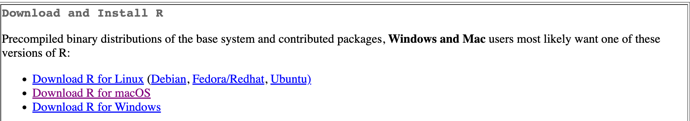
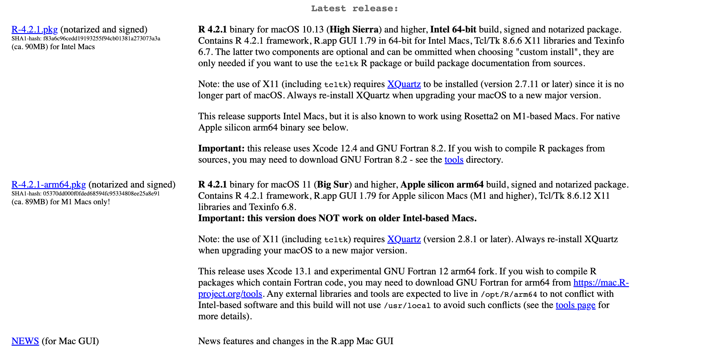

The workshop slides are special HTML files made with the R package [**xaringan**](https://bookdown.org/yihui/rmarkdown/xaringan.html). On each workshop page you'll see buttons for opening the presentation in a new tab or for downloading a PDF of the slides in case you want to print them or store them on your computer:

<i class="fas fa-external-link-alt"></i> View all slides in new window <i class="far fa-file-pdf"></i> Download PDF of all slides

The slides are also embedded on each page. You can click in the slides and navigate through them with <kbd>←</kbd> and <kbd>→</kbd>. If you type <kbd>?</kbd> (or <kbd>shift</kbd> + <kbd>/</kbd>) while viewing the slides you can see a list of slide-specific commands (like <kbd>f</kbd> for fullscreen or <kbd>p</kbd> for presenter mode if you want to see my notes).

Each workshop I will highlight a list of excellent R resources I use and have helped me learn R. I highly encourage you to check them out. I am particularly indebted to the examples and content provided by [Andrew Heiss](https://www.andrewheiss.com/) and [Grant McDermott](https://grantmcdermott.com/).

## Why R? 

<blockquote class="twitter-tweet">
Many students starting out for the first time ask &quot;Which stats software should I use? R or Stata?&quot; The debates have gotten stale so I hired the couple on TikTok again to come in and give their two cents. <a href="https://t.co/Enl9jz8KHx">pic.twitter.com/Enl9jz8KHx</a>
&mdash; scott cunningham (@causalinf) <a href="https://twitter.com/causalinf/status/1560517531227627520?ref_src=twsrc%5Etfw">August 19, 2022</a></blockquote> 

## Installing R and RStudio

### Installing R 
First we need to install R. 

1. Go to the CRAN(Collective R Archive Network) website [https://cran.r-project.org/](https://cran.r-project.org/)

2. You should see download R for your operating system some where 

  - If you use macOS make sure you choose one of the notarized and signed versions. Right now it is 4.2.1. If you have an intel based mac choose the first one. If you have an ARM mac than choose the ARM one. 
  

    - If you use Windows, click "base" (or click on the on the bolded one that says "install R for the first time and download it).
    
    
3. Double click on the downloaded file(check your `Downloads` folder). Click yes on all the prompts

4. If you are on a Mac you also need to [download and install XQuartz](https://www.xquartz.org/). If you are on a windows machine you *do not need to install XQuartz*

### Installing RStudio
Next, you need to install RStudio, the nicer integrated devloper environment (IDE) for R (the dashboard). Once R and RStudio are both installed, you can ignore R and only use RStudio. RStudio will use R automatically and you won’t ever have to interact with it directly.

1. Go to the free download location on RStudio's website: [https://www.rstudio.com/products/rstudio/download/#download](https://www.rstudio.com/products/rstudio/download/#download)

2. The Website *should* detect what operating system you are on and show a button that says *"Download RStudio for __*  If not scroll and select the Rstudio for your operating system.

3. Double click on the downloaded file(check your Downloads folderr). Click yes for each prompt.

